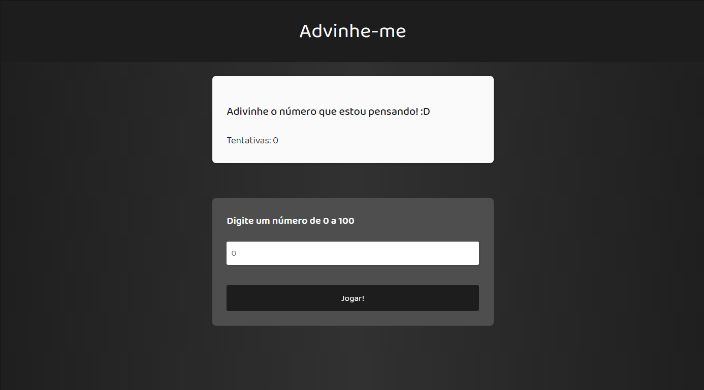
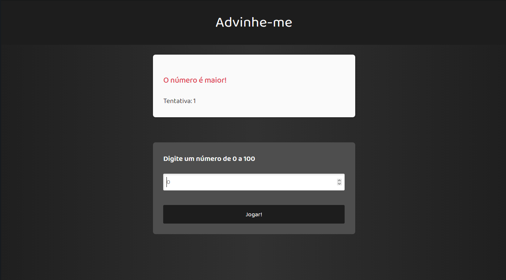
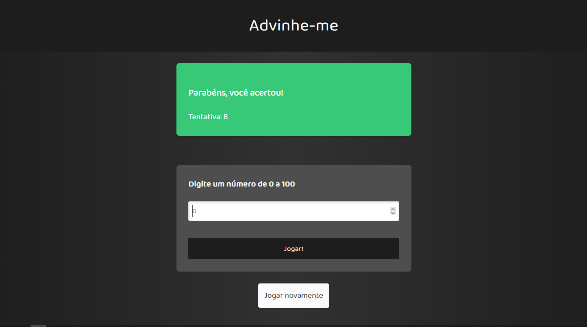

<h1 align="center">
    GUESS NUMBER
</h1>

# Sobre:

Projeto feito com Javascript puro para praticar conhecimentos adquiridos.

<h2 align="center">
    Tela inicial
    
</h2>

<h2 align="center">
    Tela de Erro
    
</h2>

<h2 align="center">
    Tela de Acerto
    
</h2>
